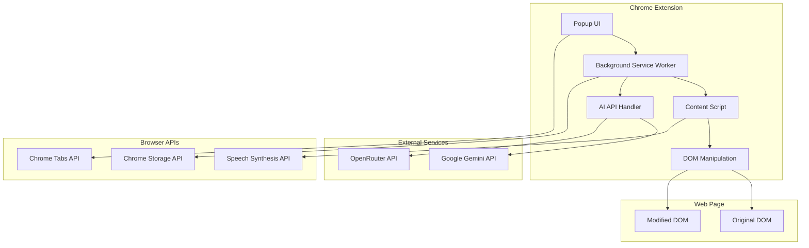
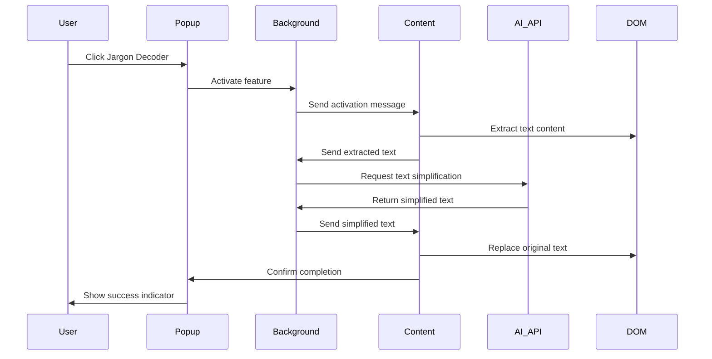

# Design Document: InclusiveRead Chrome Extension

## Overview

InclusiveRead is a Chrome Extension built using Manifest V3 that provides AI-powered accessibility features for neurodivergent users. The extension operates through a multi-component architecture consisting of content scripts for DOM manipulation, a background service worker for AI API integration, and a popup interface for user controls. The system leverages Google Gemini and OpenRouter APIs to provide real-time text simplification while maintaining privacy through local API key storage.

The extension is designed to work universally across all websites without requiring site-specific modifications, making it ideal for improving accessibility on government websites, healthcare portals, and other complex content platforms commonly used in India.

## Architecture

### High-Level Architecture



### Component Interaction Flow



## Components and Interfaces

### 1. Popup UI Component

**Purpose**: Provides the main user interface for controlling extension features.

**Key Interfaces**:
```typescript
interface PopupController {
  toggleJargonDecoder(): Promise<void>;
  toggleDyslexiaMode(): Promise<void>;
  toggleSensoryShield(): Promise<void>;
  toggleTextToSpeech(): Promise<void>;
  openSettings(): void;
  getFeatureStatus(): Promise<FeatureStatus>;
}

interface FeatureStatus {
  jargonDecoder: boolean;
  dyslexiaMode: boolean;
  sensoryShield: boolean;
  textToSpeech: boolean;
  isProcessing: boolean;
}
```

**Responsibilities**:
- Display feature toggle controls with clear visual states
- Show processing indicators during AI operations
- Provide access to settings and configuration
- Handle user interactions and send messages to background script
- Display error messages and user feedback

### 2. Background Service Worker

**Purpose**: Handles AI API communications, manages extension state, and coordinates between components.

**Key Interfaces**:
```typescript
interface BackgroundService {
  handleMessage(message: ExtensionMessage): Promise<void>;
  processTextWithAI(text: string, provider: AIProvider): Promise<string>;
  getStoredSettings(): Promise<UserSettings>;
  updateSettings(settings: Partial<UserSettings>): Promise<void>;
}

interface ExtensionMessage {
  type: 'ACTIVATE_FEATURE' | 'PROCESS_TEXT' | 'GET_SETTINGS' | 'UPDATE_SETTINGS';
  feature?: FeatureType;
  data?: any;
  tabId?: number;
}

interface AIProvider {
  name: 'gemini' | 'openrouter';
  apiKey: string;
  model?: string;
}
```

**Responsibilities**:
- Manage AI API calls with error handling and retry logic
- Store and retrieve user settings securely
- Coordinate communication between popup and content scripts
- Handle API key validation and provider switching
- Manage extension permissions and security

### 3. Content Script Component

**Purpose**: Manipulates webpage DOM to apply accessibility features and extract content.

**Key Interfaces**:
```typescript
interface ContentScriptController {
  extractPageText(): string;
  applySimplifiedText(simplifiedText: string): void;
  activateDyslexiaMode(settings: DyslexiaSettings): void;
  activateSensoryShield(): void;
  initializeTextToSpeech(): void;
  highlightCurrentText(text: string): void;
}

interface DyslexiaSettings {
  fontFamily: string;
  lineSpacing: number;
  letterSpacing: number;
  colorOverlay: string;
}

interface TextProcessor {
  extractMainContent(): string;
  preserveFormatting(originalElement: Element, newText: string): void;
  identifyTextElements(): NodeList;
}
```

**Responsibilities**:
- Extract text content while preserving document structure
- Apply visual modifications for dyslexia support
- Disable animations and distracting elements
- Integrate with browser's Speech Synthesis API
- Maintain original DOM state for feature toggling

### 4. AI Integration Handler

**Purpose**: Manages communication with external AI services for text simplification.

**Key Interfaces**:
```typescript
interface AIHandler {
  simplifyText(text: string, provider: AIProvider): Promise<string>;
  validateApiKey(provider: AIProvider): Promise<boolean>;
  handleApiError(error: APIError): string;
}

interface APIError {
  code: number;
  message: string;
  provider: string;
  retryable: boolean;
}

interface SimplificationRequest {
  text: string;
  maxLength?: number;
  readingLevel?: 'elementary' | 'middle' | 'high';
  preserveFormatting: boolean;
}
```

**Responsibilities**:
- Format requests for different AI providers
- Handle API authentication and rate limiting
- Process and validate AI responses
- Implement fallback strategies for API failures
- Optimize text chunking for large content

## Data Models

### User Settings Model

```typescript
interface UserSettings {
  // AI Provider Configuration
  aiProvider: 'gemini' | 'openrouter';
  geminiApiKey?: string;
  openrouterApiKey?: string;
  
  // Feature Preferences
  dyslexiaSettings: DyslexiaSettings;
  ttsSettings: TTSSettings;
  sensoryShieldLevel: 'mild' | 'moderate' | 'aggressive';
  
  // UI Preferences
  showTooltips: boolean;
  keyboardShortcuts: boolean;
  
  // Privacy Settings
  dataRetention: 'session' | 'persistent';
  analyticsEnabled: boolean;
}

interface TTSSettings {
  voice: string;
  rate: number; // 0.1 to 10
  pitch: number; // 0 to 2
  volume: number; // 0 to 1
  highlightColor: string;
}
```

### Extension State Model

```typescript
interface ExtensionState {
  activeFeatures: Set<FeatureType>;
  currentTab: number;
  processingStatus: ProcessingStatus;
  lastError?: string;
  apiUsage: APIUsageStats;
}

interface ProcessingStatus {
  isProcessing: boolean;
  feature?: FeatureType;
  progress?: number;
  estimatedCompletion?: number;
}

interface APIUsageStats {
  requestsToday: number;
  tokensUsed: number;
  lastReset: Date;
  rateLimitRemaining: number;
}
```

### Content Analysis Model

```typescript
interface PageContent {
  mainText: string;
  headings: string[];
  links: LinkInfo[];
  images: ImageInfo[];
  complexity: ContentComplexity;
}

interface ContentComplexity {
  readingLevel: number;
  averageWordsPerSentence: number;
  technicalTermCount: number;
  estimatedReadingTime: number;
}

interface LinkInfo {
  text: string;
  url: string;
  isExternal: boolean;
}

interface ImageInfo {
  alt: string;
  src: string;
  hasCaption: boolean;
}
```

Now I need to use the prework tool to analyze the acceptance criteria before writing the Correctness Properties section.

<function_calls>
<invoke name="prework">
<parameter name="featureName">inclusive-read

## Correctness Properties

*A property is a characteristic or behavior that should hold true across all valid executions of a system—essentially, a formal statement about what the system should do. Properties serve as the bridge between human-readable specifications and machine-verifiable correctness guarantees.*

### Property 1: Text Extraction Completeness
*For any* webpage DOM structure containing text content, the Extension should extract all visible text while preserving the hierarchical structure and relationships between elements.
**Validates: Requirements 1.1**

### Property 2: AI Provider Communication
*For any* extracted text content and configured AI provider, the Background Service should successfully format and transmit the text to the correct API endpoint with proper authentication.
**Validates: Requirements 1.2, 1.6, 1.7**

### Property 3: DOM Text Replacement with Structure Preservation
*For any* DOM structure with text content, when AI-simplified text is applied, the original DOM structure, styling, and element relationships should be preserved while only the text content is updated.
**Validates: Requirements 1.3**

### Property 4: Loading State Management
*For any* AI processing operation, the Extension should display appropriate loading indicators during processing and remove them upon completion or error.
**Validates: Requirements 1.4**

### Property 5: Error Handling with Content Preservation
*For any* AI API failure or error condition, the Extension should display appropriate error messages while maintaining the original webpage content unchanged.
**Validates: Requirements 1.5, 9.3**

### Property 6: Dyslexia Mode Comprehensive Styling
*For any* webpage with text elements, when Dyslexia Mode is activated with specific settings, all text elements should receive the configured font family, line spacing, letter spacing, and color overlay consistently.
**Validates: Requirements 2.1, 2.2, 2.3, 2.4**

### Property 7: Real-time Settings Application
*For any* Dyslexia Mode setting change, the modifications should be applied immediately to all affected DOM elements without requiring page reload.
**Validates: Requirements 2.5**

### Property 8: Settings Persistence Round-trip
*For any* user preference or setting, storing then retrieving the setting should produce an equivalent value across browser sessions.
**Validates: Requirements 2.6**

### Property 9: Sensory Shield Comprehensive Disabling
*For any* webpage containing animations, auto-playing videos, blinking elements, or parallax effects, activating Sensory Shield should disable or freeze all such distracting elements.
**Validates: Requirements 3.1, 3.2, 3.3, 3.4**

### Property 10: Sensory Shield State Restoration
*For any* webpage, activating Sensory Shield then deactivating it should restore the original animations and effects to their initial state.
**Validates: Requirements 3.5**

### Property 11: TTS Content Identification and Playback
*For any* webpage with readable content, activating Text-to-Speech should correctly identify the main content and begin reading it using the browser's Speech Synthesis API.
**Validates: Requirements 4.1, 4.6**

### Property 12: TTS Visual Synchronization
*For any* text being read aloud, the visual highlighting should accurately track and highlight the currently spoken words or sentences.
**Validates: Requirements 4.2**

### Property 13: TTS Position Control
*For any* text element clicked by the user, TTS should begin reading from that specific position in the content.
**Validates: Requirements 4.3**

### Property 14: TTS Playback Controls
*For any* active TTS session, all playback controls (play, pause, stop, speed adjustment, sentence navigation) should function correctly and affect the speech output appropriately.
**Validates: Requirements 4.4, 4.5**

### Property 15: Universal Website Compatibility
*For any* website visited by the user, the Content Script should load successfully and all extension features should be available for activation without requiring site-specific modifications.
**Validates: Requirements 5.2, 5.5**

### Property 16: Asynchronous API Operations
*For any* AI API call or external service request, the operation should not block the user interface and should allow continued interaction with other extension features.
**Validates: Requirements 5.4**

### Property 17: Secure Storage Round-trip
*For any* API key or sensitive configuration data, storing it using Chrome's secure storage then retrieving it should produce the equivalent value while maintaining security.
**Validates: Requirements 6.1**

### Property 18: Privacy Compliance
*For any* text processed by AI providers or user interaction with the extension, no personal data, browsing history, or processed content should be stored, logged, or transmitted beyond the immediate API request.
**Validates: Requirements 6.2, 6.3**

### Property 19: Secure Error Handling
*For any* API error or system failure, error messages displayed to users should not contain sensitive information such as API keys, internal system details, or personal data.
**Validates: Requirements 6.4**

### Property 20: Data Clearing Completeness
*For any* stored user data or preferences, the clear data function should remove all traces of the information from local storage.
**Validates: Requirements 6.5**

### Property 21: UI State Reflection
*For any* feature activation or deactivation, the Popup UI should immediately reflect the correct state with appropriate visual feedback.
**Validates: Requirements 7.2**

### Property 22: Tooltip Information Provision
*For any* UI control element, hovering should display helpful tooltips that accurately describe the feature's functionality.
**Validates: Requirements 7.4**

### Property 23: Keyboard Accessibility
*For any* UI element in the extension interface, keyboard navigation should provide equivalent functionality to mouse interactions.
**Validates: Requirements 7.5**

### Property 24: Progress Indication Accuracy
*For any* processing operation, progress indicators should accurately reflect the current state and provide meaningful feedback to users.
**Validates: Requirements 7.6**

### Property 25: Comprehensive Settings Configuration
*For any* configurable aspect of the extension (AI providers, API keys, dyslexia preferences, TTS settings), the settings interface should allow modification and immediate application of changes.
**Validates: Requirements 8.2, 8.3, 8.4, 8.5, 8.6**

### Property 26: Error Isolation and Graceful Degradation
*For any* JavaScript error or component failure, unaffected features should continue to function normally while the failed component provides appropriate error feedback.
**Validates: Requirements 9.6**

### Property 27: Analytics Data Collection
*For any* user interaction with extension features, appropriate usage metrics should be collected (when enabled) to demonstrate social impact and feature effectiveness.
**Validates: Requirements 10.6**

## Error Handling

### Error Categories and Strategies

**AI API Errors**:
- Network connectivity failures: Retry with exponential backoff, fallback to cached content
- Authentication errors: Clear invalid API keys, prompt user for reconfiguration
- Rate limiting: Queue requests, display wait times, suggest alternative providers
- Invalid responses: Validate AI output, fallback to original content on parsing errors

**DOM Manipulation Errors**:
- Protected elements: Skip modification, log warnings, continue with other elements
- Dynamic content changes: Re-scan DOM periodically, handle element removal gracefully
- CSS conflicts: Use high-specificity selectors, implement !important overrides carefully
- Memory constraints: Implement content chunking, cleanup unused references

**Storage and Persistence Errors**:
- Storage quota exceeded: Implement data cleanup, prioritize essential settings
- Corrupted data: Validate on read, reset to defaults on corruption detection
- Permission denied: Request necessary permissions, provide fallback functionality
- Sync conflicts: Implement last-write-wins with user notification

**Browser Compatibility Errors**:
- Missing APIs: Feature detection, graceful degradation, user notification
- Version incompatibilities: Manifest version checks, feature flags
- Security policy violations: Adjust CSP compliance, use alternative approaches
- Extension conflicts: Namespace isolation, conflict detection and resolution

## Testing Strategy

### Dual Testing Approach

The InclusiveRead extension requires both unit testing and property-based testing to ensure comprehensive coverage and reliability:

**Unit Tests** focus on:
- Specific examples of text simplification with known inputs and expected outputs
- Edge cases like empty content, malformed HTML, or extremely long text
- Integration points between popup, background service, and content scripts
- Error conditions such as API failures, network timeouts, and invalid configurations
- Browser API interactions and Chrome extension lifecycle events

**Property-Based Tests** focus on:
- Universal properties that must hold across all possible webpage structures
- AI provider communication patterns that should work regardless of content
- DOM manipulation correctness across diverse website layouts
- Settings persistence and retrieval across different data combinations
- Feature interaction behaviors that should remain consistent

### Property-Based Testing Configuration

**Testing Framework**: Jest with fast-check library for property-based testing
**Test Configuration**:
- Minimum 100 iterations per property test to ensure statistical confidence
- Custom generators for DOM structures, text content, and user settings
- Shrinking enabled to find minimal failing cases
- Timeout configuration for AI API integration tests

**Test Tagging Format**:
Each property-based test must include a comment referencing its design document property:
```javascript
// Feature: inclusive-read, Property 1: Text Extraction Completeness
```

**Property Test Implementation Requirements**:
- Each correctness property must be implemented by exactly one property-based test
- Tests must generate diverse, realistic input data using custom generators
- AI API tests should use mock providers to avoid external dependencies during testing
- DOM manipulation tests should create varied HTML structures programmatically
- Settings tests should generate all valid combinations of user preferences

### Integration Testing Strategy

**Cross-Component Testing**:
- End-to-end workflows from popup interaction to DOM modification
- Message passing between extension components
- State synchronization across browser tabs
- Feature interaction testing (multiple features active simultaneously)

**Browser Environment Testing**:
- Chrome extension sandbox environment simulation
- Content Security Policy compliance verification
- Permission model validation
- Storage API integration testing

**AI Provider Integration Testing**:
- Mock API responses for consistent testing
- Error simulation for resilience testing
- Rate limiting and retry logic validation
- Response parsing and validation testing

### Performance and Accessibility Testing

**Performance Benchmarks**:
- DOM manipulation operations should complete within 2 seconds
- AI API calls should timeout appropriately with user feedback
- Memory usage should remain below 50MB during normal operation
- Extension startup time should not exceed 1 second

**Accessibility Validation**:
- Color contrast ratio verification for all UI elements
- Keyboard navigation path testing
- Screen reader compatibility verification
- Focus management during feature activation

**Compatibility Testing**:
- Cross-website compatibility across diverse site structures
- Chrome version compatibility (minimum supported version)
- Conflict testing with other popular extensions
- Mobile Chrome compatibility for responsive design